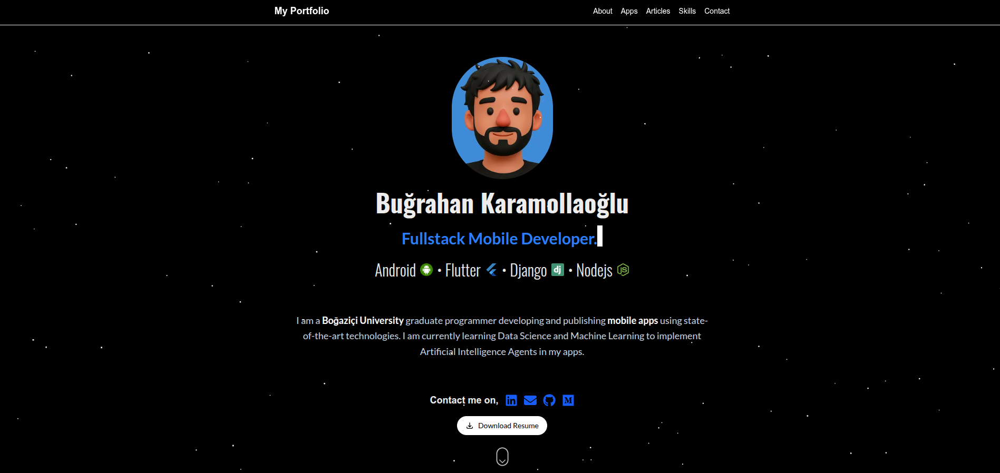

# About me

Explore my full portfolio and resume at:  
[www.bugrahankaramollaoglu.com](https://www.bugrahankaramollaoglu.com)

---

## Education
I am a versatile Android/Flutter developer with a good foundation in cs · mobile applications. I implement a wide span of mobile technologies in developing my apps and I am learning to integrate AI agents for a better suitability with the state-of-the-art technologies. 

- **Education:** Boğaziçi University, B.a
- **Specialization:** Mobile Development (Kotlin, Java, Jetpack Compose, Flutter)  
- **Additional Training:**  
  - 42 Istanbul — Software Engineering (C, C++)  
  - Google Academy — Flutter & Project Management

---

## Tools & Technologies

  
  
  

---

## Published Mobile Applications

- **[Sentensearch](https://play.google.com/store/apps/details?id=com.bugrahankaramollaoglu.sentensearch)** — Language learning app available on Google Play Store

---

## Selected Mobile Projects

| [Tasty](https://github.com/bugrahankaramollaoglu/tasty) | [Sentensearch](https://github.com/bugrahankaramollaoglu/sentensearch) | [Gojo](https://github.com/bugrahankaramollaoglu/gojo) | [Rota Portali](https://github.com/bugrahankaramollaoglu/rota_portali) |
|:-------------------------:|:------------------------------:|:-----------------------:|:-------------------:|
|  |  |  |  |

| [Greefin](https://github.com/bugrahankaramollaoglu/greefin) | [Remindly](https://github.com/bugrahankaramollaoglu/remindly) | [Weatherly](https://github.com/bugrahankaramollaoglu/weatherly) | [Catch Flappy](https://github.com/bugrahankaramollaoglu/catch-flappy) |
|:-------------------------:|:------------------------------:|:-----------------:|:-----------------:|
|  |  |  |  |

---

## Selected Articles

I regularly publish technical articles sharing insights and tutorials on software development:

- [Pillars of OOP](https://medium.com/@bugrakaramollaoglu/pillars-of-oop-ed42fb6d29e8)  
- [ListView & RecyclerView in Android](https://medium.com/@bugrakaramollaoglu/listview-and-recyclerview-android-78e4d38b23c6)  
- [Introduction to SQLite in Android](https://medium.com/@bugrakaramollaoglu/sqlite-nedir-nas%C4%B1l-kullan%C4%B1l%C4%B1r-c0a766e0519e)  
- [Using APIs in Android](https://medium.com/@bugrakaramollaoglu/%C3%BCcretsiz-api-kaynaklar%C4%B1-nas%C4%B1l-kullan%C4%B1l%C4%B1r-hava-durumu-68036a06d3e2)  
- [Implementing Onboarding in Flutter](https://medium.com/@bugrahankaramollaoglu/how-to-implement-onboarding-in-flutter-a334386dfb9b)  
- [Makefile Tutorial](https://medium.com/@bugrakaramollaoglu/makefile-tutorial-e95b25078633)

---

  Feel free to contact me on  
  <a href="mailto:bugrahankaramollaoglu@gmail.com" title="Send Email">📧</a>

